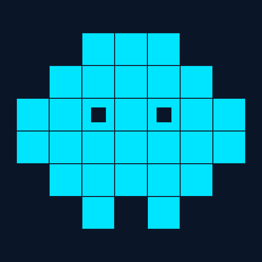
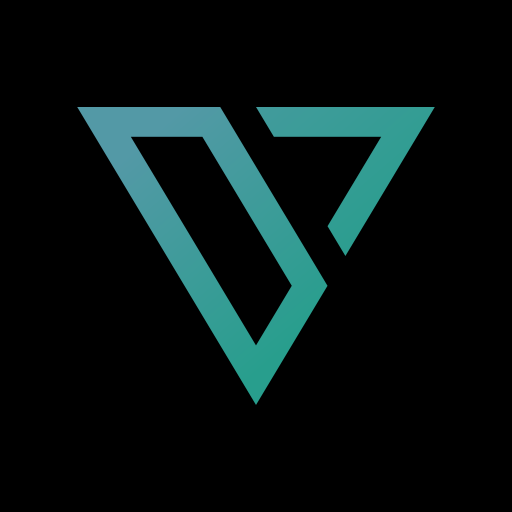

<table>
<tr>
<td width="50%" valign="top">

<h3>About</h3>

Builder who can't stop shipping — products, open-source, and companies. Now all-in on AI.

<ul>
<li><b>Now building</b> in AI at <a href="https://sidan.ai">SIDAN AI</a></li>
<li>Co-founder at <a href="https://deltadefi.io">DeltaDeFi</a> & <a href="https://sidan.io">SIDAN Lab</a></li>
<li>Cardano Ambassador & DRep</li>
<li>Draper University Alumni</li>
<li>Hong Kong</li>
</ul>

</td>
<td width="50%" valign="top">

<h3>Tech Stack</h3>

<pre>
AI / Agents  LLMs | RAG | MCP
Backend      Rust | Go | TS
Frontend     React | Next.js
Contracts    Aiken | Plutus
Infra        Docker | Actions
</pre>

</td>
</tr>
</table>

<h3>Building</h3>

<table>
<tr>
<td width="34%" align="center" valign="top">
 

  

  
Building the infrastructure to run my stuff
  
<a href="https://sidan.ai">Website</a>
  
</td>
<td width="33%" align="center" valign="top">
 

  

  
Building a trading system serious enough to trust your money with
  
<a href="https://deltadefi.io">Website</a>
  
</td>
<td width="33%" align="center" valign="top">
 

  

  
Building open source, and the community around it
  
<a href="https://sidan.io">Website</a>
  
</td>
</tr>
</table>

<h3>Open Source</h3>

Open-source projects I build and contribute to — from AI tooling to the Cardano stack.

<table>
<thead>
<tr>
<th>Library</th>
<th>Language</th>
<th>Description</th>
<th></th>
</tr>
</thead>
<tbody>
<tr>
<td><a href="https://github.com/sidanclaw/sidanclaw"><b>sidanclaw</b></a></td>
<td>TypeScript</td>
<td>Brain, agents and workflows — a local framework to automate your work</td>
<td></td>
</tr>
<tr>
<td><a href="https://github.com/MeshJS/mesh"><b>Mesh</b></a></td>
<td>TypeScript</td>
<td>Open-source Web3 SDK for building applications on Cardano blockchain</td>
<td></td>
</tr>
<tr>
<td><a href="https://github.com/sidan-lab/whisky"><b>Whisky</b></a></td>
<td>Rust</td>
<td>Cardano transaction building, serialization and wallet management library</td>
<td></td>
</tr>
<tr>
<td><a href="https://github.com/sidan-lab/vodka"><b>Vodka</b></a></td>
<td>Aiken</td>
<td>Smart contract utilities, testing helpers and validation functions</td>
<td></td>
</tr>
</tbody>
</table>

<h3>Stats</h3>

<h3>Connect</h3>

  

<i>"Open source is not just about code — it's about building communities."</i>

